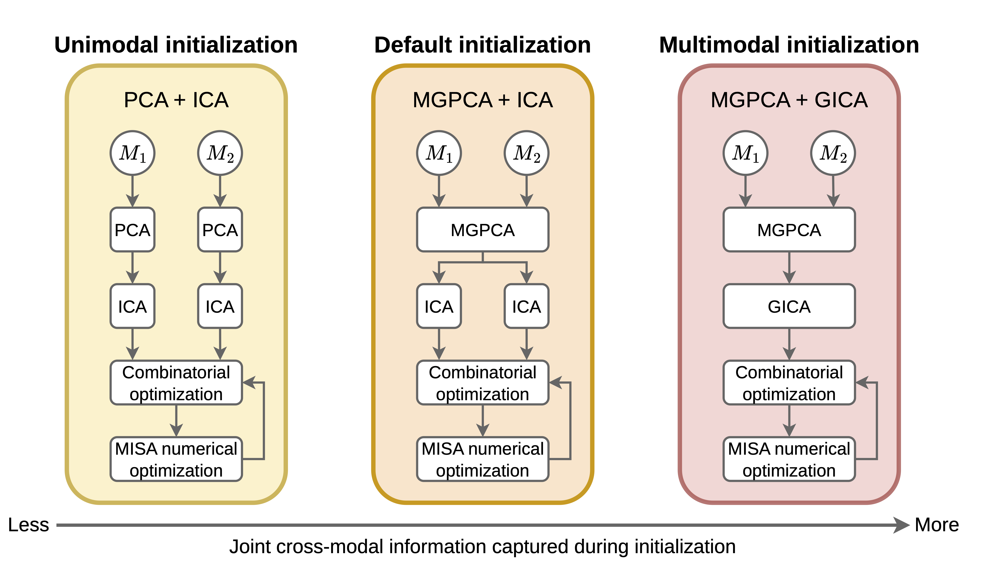

# Multimodal Subspace Independent Vector Analysis (MSIVA)

This repository contains MATLAB implementation for Multimodal Subspace Independent Vector Analysis (MSIVA).



## Workflows

| Description | Script |
|-------------|--------|
| MSIVA default initialization | [`run_mgpca_ica.m`](scripts/SIVA/run_mgpca_ica.m) |
| Unimodal initialization | [`run_pca_ica.m`](scripts/SIVA/run_pca_ica.m) |
| Multimodal initialization | [`run_mgpca_gica.m`](scripts/SIVA/run_mgpca_gica.m) |

## Experiments

| Description | Script |
|-------------|--------|
| Synthetic data experiment | [`func_sim.m`](scripts/SIVA/func_sim.m) |
| Neuroimaging data experiment | [`func_img.m`](scripts/SIVA/func_img.m) |

## Figures

### Imaging Neuroscience

| Figure | Script |
|--------|--------|
| Fig. 1 | [`plot_subspace_struct.ipynb`](figures/IMAG2026/plot_subspace_struct.ipynb) |
| Fig. 3 | [`plot_sim.ipynb`](figures/IMAG2026/plot_sim.ipynb) |
| Fig. 4 | [`plot_sim.ipynb`](figures/IMAG2026/plot_sim.ipynb) |
| Fig. 5a | [`plot_img_ukb.ipynb`](figures/IMAG2026/plot_img_ukb.ipynb) |
| Fig. 5b | [`plot_img_sz.ipynb`](figures/IMAG2026/plot_img_sz.ipynb) |
| Fig. 6 | [`plot_img_loss.ipynb`](figures/IMAG2026/plot_img_loss.ipynb) |
| Fig. 7 | [`plot_img_ukb.ipynb`](figures/IMAG2026/plot_img_ukb.ipynb) |
| Fig. 8 | [`plot_img_sz.ipynb`](figures/IMAG2026/plot_img_sz.ipynb) |
| Fig. 9 | [`dualcodeImage_AY_geomedian.m`](figures/IMAG2026/dualcodeImage_AY_geomedian.m), [`plot_img_ukb.ipynb`](figures/IMAG2026/plot_img_ukb.ipynb) |
| Fig. 10 | [`dualcodeImage_AY_geomedian.m`](figures/IMAG2026/dualcodeImage_AY_geomedian.m), [`plot_img_sz.ipynb`](figures/IMAG2026/plot_img_sz.ipynb) |
| Fig. 11 | [`plot_sig_voxel.ipynb`](figures/IMAG2026/plot_sig_voxel.ipynb) |
| Fig. 12 | (1) Run [`age_delta.m`](figures/IMAG2026/age_delta.m) to compute brain-age delta. (2) Run [`compute_geometric_median.py`](figures/IMAG2026/compute_geometric_median.py) to compute geometric median of brain-age delta. (3) Run [`phenotype_map.py`](figures/IMAG2026/phenotype_map.py) to compute spatial correlation between brain-age delta and phenotype variable. (4) Use [`dualcodeImage_beta1.m`](figures/IMAG2026/dualcodeImage_beta1.m), [`dualcodeImage_delta2p_std.m`](figures/IMAG2026/dualcodeImage_delta2p_std.m), [`dualcodeImage_delta2p_geomedian.m`](figures/IMAG2026/dualcodeImage_delta2p_geomedian.m), and [`dualcodeImage_phenotype.m`](figures/IMAG2026/dualcodeImage_phenotype.m) to plot the dual-coded maps. |
| Fig. S1 | [`dualcodeImage_beta1.m`](figures/IMAG2026/dualcodeImage_beta1.m) |
| Fig. S2 | [`plot_init_corr.ipynb`](figures/IMAG2026/plot_init_corr.ipynb) |
| Figs. S3 & S4 | [`plot_loss.ipynb`](figures/IMAG2026/plot_loss.ipynb) |
| Fig. S5 | [`plot_itc.ipynb`](figures/IMAG2026/plot_itc.ipynb) |
| Fig. S6a | [`plot_img_ukb_rdc.ipynb`](figures/IMAG2026/plot_img_ukb_rdc.ipynb) |
| Fig. S6b | [`plot_img_sz_rdc.ipynb`](figures/IMAG2026/plot_img_sz_rdc.ipynb) |
| Fig. S7 | [`plot_img_sz.ipynb`](figures/IMAG2026/plot_img_sz.ipynb) |
| Fig. S8 | [`dualcodeImage_AY_geomedian.m`](figures/IMAG2026/dualcodeImage_AY_geomedian.m), [`plot_img_ukb.ipynb`](figures/IMAG2026/plot_img_ukb.ipynb) |
| Fig. S9 | [`dualcodeImage_AY_geomedian.m`](figures/IMAG2026/dualcodeImage_AY_geomedian.m), [`plot_img_sz.ipynb`](figures/IMAG2026/plot_img_sz.ipynb) |
| Fig. S10 | [`plot_num_crossmodal_voxel.ipynb`](figures/IMAG2026/plot_num_crossmodal_voxel.ipynb) |
| Figs. S11 & S12 | [`compare_mmiva_msiva_ukb.ipynb`](figures/IMAG2026/compare_mmiva_msiva_ukb.ipynb) |
| Figs. S13 & S14 | [`compare_mmiva_msiva_sz.ipynb`](figures/IMAG2026/compare_mmiva_msiva_sz.ipynb) |

### ISBI

| Figure | Script |
|--------|--------|
| Fig. 1 | [`plot_subspace_struct.ipynb`](figures/ISBI2023/plot_subspace_struct.ipynb) |
| Fig. 2 | [`plot_sim.ipynb`](figures/ISBI2023/plot_sim.ipynb) |
| Fig. 3 | [`plot_sim.ipynb`](figures/ISBI2023/plot_sim.ipynb) |
| Fig. 4 | [`plot_img.ipynb`](figures/ISBI2023/plot_img.ipynb) |
| Fig. 5 | [`plot_img.ipynb`](figures/ISBI2023/plot_img.ipynb) |
| Fig. 6 | [`dualmap.m`](figures/ISBI2023/dualmap.m) |

## Prerequisites

MSIVA builds on [Multidataset Independent Subspace Analysis (MISA)](https://github.com/rsilva8/MISA), which is already included in this repository. It also requires:

- [MATLAB Optimization Toolbox](https://www.mathworks.com/products/optimization.html)
- [MATLAB Statistics and Machine Learning Toolbox](https://www.mathworks.com/products/statistics.html)
- [Group ICA of fMRI Toolbox (GIFT)](https://github.com/trendscenter/gift.git) — see installation instructions below.

### Installing GIFT
**1. Clone the repository** (in a terminal):
```
git clone https://github.com/trendscenter/gift.git
```

**2. Navigate to the GIFT directory** (in MATLAB):
```
cd gift/GroupICAT/icatb
```

**3. Run the installer** (in the MATLAB command window):
```
groupica fmri 
```

A GUI window will open upon successful installation — you can close it by clicking **Exit**.

## References
If you find this repository useful, please cite the following papers:
```
@article{li2026multimodal,
    author = {Li, Xinhui and Kochunov, Peter and Adali, Tulay and Silva, Rogers F. and Calhoun, Vince D.},
    title = {Multimodal subspace independent vector analysis effectively captures latent relationships between brain structure and function},
    journal = {Imaging Neuroscience},
    year = {2026},
    month = {05},
    issn = {2837-6056},
    doi = {10.1162/IMAG.a.1266},
    url = {https://doi.org/10.1162/IMAG.a.1266},
    eprint = {https://direct.mit.edu/imag/article-pdf/doi/10.1162/IMAG.a.1266/2600396/imag.a.1266.pdf},
}

@INPROCEEDINGS{li2023multimodal,
  author={Li, Xinhui and Adali, Tulay and Silva, Rogers F. and Calhoun, Vince D.},
  booktitle={2023 IEEE 20th International Symposium on Biomedical Imaging (ISBI)}, 
  title={Multimodal Subspace Independent Vector Analysis Better Captures Hidden Relationships in Multimodal Neuroimaging Data}, 
  year={2023},
  pages={1-5},
  doi={10.1109/ISBI53787.2023.10230605}
}
```